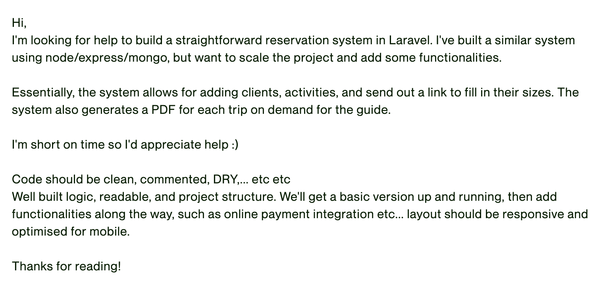
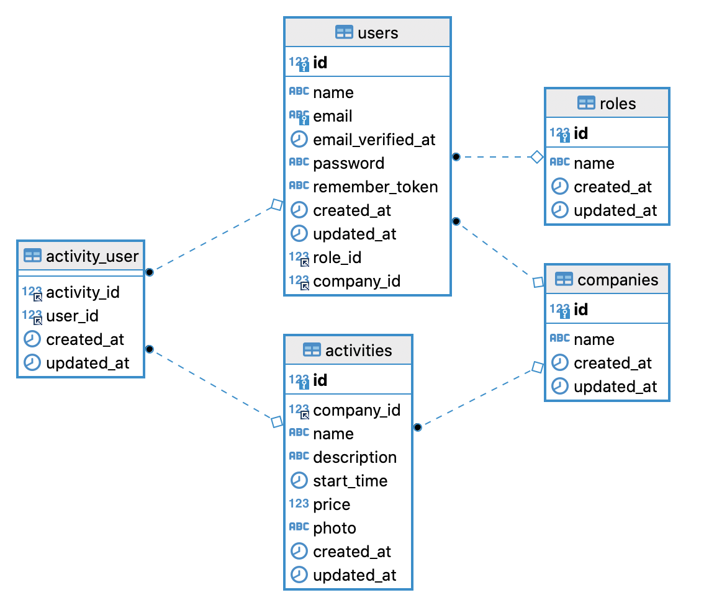

Our first goal, before even starting the coding process, is to transform the initial job description from the client into a proper **plan of action**. There are many ways to do this, and I will explain my own way.

---

## Initial Description from Client

Let's take a look at the initial description of the project, based on a [real job from Upwork](https://www.upwork.com/jobs/~013ff67ca387ff9ae2):



This is how typically clients describe the projects, right? In their own words, briefly, without digging into details. And that's fine, they are not specialists.

So the job of a developer, especially a freelancer, is this:

- Transform it into a real plan of action
- While preparing that plan, gather and ask many questions
- Review/edit that plan after getting the answers

Generally, I see my goal as transforming the description into these three concrete things:

- DB Tables Schema and Models
- List of Features to Build
- Step-by-Step Plan of Actions (*a SORTED version of feature list above*)

So, let's try to work on exactly that, one by one.

Of course, a lot of things are totally unclear in this simplified job description, and we don't have the contact with the client to ask, so we will **assume** a lot in the course below.

---

## DB Tables Schema and Models

After re-reading the brief job description, I noted down the list of *entities* which is just a fancy word meaning the equivalent of Eloquent Models or DB Tables. 

Also, I immediately try to envision the fields of the tables, cause that may lead to follow-up questions to the client

- **Roles**: just one field `name` (I envision roles: "administrator", "company owner", "customer" and "guide")
- **Users**: typical default Laravel DB table, adding `role_id` (*we will manage simple permissions in Gates, no DB table needed*)
- **Companies**: just one field `name` - for activity organizers
- **Activities**: `company_id`, `guide_id`, `name`, `description`, `start_time`, `price`, `photo(s)`
- **Participants**: which is actually a pivot table `activity_user` with two foreign keys

And that's it! So it seems that we will have a very small project, but will cover all the Laravel basics to make it very practical and learn a lot.

Remember: at this point, your goal is not to build a perfect DB schema from the beginning, but identify the **unclear parts** which would lead to the list of questions to the client.

---

## Laravel Project, Migrations, and DB Schema

What I like to do immediately is to **visualize** the relationships. There are different tools for this, but my personal preference is to spin up a Laravel project, create migrations, run them, and prepare the visual schema from a real database, instead of drawing and entering DB table/column names in some external tool.

So...

```sh
laravel new reservations
cd reservations
``` 

And we have a new Laravel project!

Then, these Terminal commands generate models and migrations:

```sh
php artisan make:model Role -m
php artisan make:migration add_role_id_to_users_table
```

**Roles Migrations**:
```php
public function up(): void
{
    Schema::create('roles', function (Blueprint $table) {
        $table->id();
        $table->string('name');
        $table->timestamps();
    });
}
```

**app/Models/Role.php**:
```php
class Role extends Model
{
    use HasFactory;
    
    protected $fillable = ['name'];
}
```

**Adding Role ID Migration**:
```php
Schema::table('users', function (Blueprint $table) {
    $table->foreignId('role_id')->constrained();
});
```

**app/Models/User.php**:
```php
class User extends Authenticatable
{
    protected $fillable = [
        'name',
        'email',
        'password',
        'role_id' // [tl! ++]
    ];

    // ...

    public function role()
    {
        return $this->belongsTo(Role::class);
    }
}
```

Next, creating **companies**.

```sh
php artisan make:model Company -m
php artisan make:migration add_company_id_to_users_table
```

**Companies migration**:
```php
Schema::create('companies', function (Blueprint $table) {
    $table->id();
    $table->string('name');
    $table->timestamps();
});
```

**app/Models/Company.php**:
```php
class Company extends Model
{
    use HasFactory;
    
    protected $fillable = ['name'];
}
```

**Adding Company ID Migration**:
```php
Schema::table('users', function (Blueprint $table) {
    $table->foreignId('company_id')->nullable()->constrained();
});
```

**Notice**: in this case, a company may be `nullable`, because only one role will belong to a company.

**app/Models/User.php**:
```php
class User extends Authenticatable
{
    protected $fillable = [
        'name',
        'email',
        'password',
        'role_id' 
        'company_id' // [tl! ++]
    ];

    // ...

    public function company()
    {
        return $this->belongsTo(Company::class);
    }
}
```

Finally, the schema for **activities**.

```sh
php artisan make:model Activity -m
php artisan make:migration create_activity_user_table
```

**Activities Migration**:
```php
Schema::create('activities', function (Blueprint $table) {
    $table->id();
    $table->foreignId('company_id')->constrained();  
    $table->foreignId('guide_id')->nullable()->constrained('users');
    $table->string('name');
    $table->text('description');
    $table->dateTime('start_time');
    $table->integer('price');
    $table->string('photo')->nullable();
    $table->timestamps();
});
```

**Notice**: For now, I don't overcomplicate the photo(s) field and plan to save just the filename, but this will actually be one of the questions to the client (*we'll get to the questions below*). Eventually, we may move to use Spatie Media Library with its own `media` DB table. The technical solution isn't *that* important at this stage.

**app/Models/Activity.php**:
```php
class Activity extends Model
{
    use HasFactory;

    protected $fillable = [
        'company_id',
        'guide_id',
        'name',
        'description',
        'start_time',
        'price',
        'photo'
    ];

    public function company()
    {
        return $this->belongsTo(Company::class);
    }

    public function participants()
    {
        return $this->belongsToMany(User::class)->withTimestamps();
    }
}
```

**Activity participants migration**:
```php
Schema::create('activity_user', function (Blueprint $table) {
    $table->foreignId('activity_id')->constrained();
    $table->foreignId('user_id')->constrained();
    $table->timestamps();
});
```

**Notice 1**: I've named the relationship `participants()` and not just `users()`, for more clarity.

**Notice 2**: Pretty sure it will be important to know WHEN someone registered for the activity, so I added `withTimestamps()` to this pivot table. 

And now, we run the migrations on the empty DB table...

```sh
php artisan migrate
```


Now, when we have the DB schema, we can use any external tool to export it as a visual, with relationships. I personally use [DBeaver](https://dbeaver.io/) for this, which gives us this result:



Great!

Now, wait, our goal wasn't the DB schema, we planned to create a plan of action and a list of questions for the client?

---

## Feature List

Ok, now as our DB entities are clear(er), we can try to list the features our application will need.

I do that as a "quick braindump", in no particular order, just what comes to mind, for each role:

**Admin:**

- Manage companies and their users
- View / Manage activities

**Company owner**: 

- Manage guides for their companies
- Manage activities and assign guides

**Public**:

- View all activities
- Register for the activity

**Customer**:

- View MY activities
- Cancel my reservations

**Guide**:

- View activities I'm assigned to
- Export PDF of participants

Looks cool to me. Now, let's try to **reorder** that list and transform it into a plan of action.

---

## Plan of Actions

This is essentially the same as above, but thinking about **implementation**. 

One of the goals is to build the actual "calendar" of tasks for us and to discover which feature depends on other features to be built earlier.

After some tweaking, I came up with this list, **numbered** this time:

1. DB structure (*done*)
2. Laravel Breeze with CRUD of Companies
3. Roles/permissions: Manage companies is only for the admin role (*here we'll start writing tests for each feature*)
4. Admin: managing **users** of the company (*adding multi-tenancy*)
5. Login with company role: manage guides
6. Company role: manage activities and assign guides 
7. Sending an email to the guide
8. Company users can also view/manage activities
9. Public homepage with a list of activities
10. Registration to the activity as a customer
11. Login with customer role: view my activities and cancel them
12. Login with guide role: view my activities
13. Guide export PDF

This is, of course, a **draft** that may change a lot, but it's something to start with. 

The next step is "thinking exercise": imagine going through those steps in your mind, and your brain should automatically come up with a bunch of questions on how exactly things should work. Note them down.

---

## List of Questions To Ask Client

So if I was a freelancer who saw this job post, I would think about a bunch of things unclear in my head. The best way to "unclear" your mind in such situations is to, well, just ask the client.

In fact, I have won many freelance pitches for projects just by starting with a **conversation** and questions, instead of just telling "I'm a developer with X years of experience and I can build this project for you".

So, these are just **some** of the questions I would ask:

1. You haven't mentioned anything about visual design: do you have something in mind? Or would you want to pick from these design templates? (attaching a link)
2. Would each company have only one user who would manage activities or multiple? (would cost extra)
3. What information is needed for the activity: title, description, photos, price? Anything else?
4. Can the guide be assigned to only one company or multiple? How do they get invited or register on the system?
5. What should the PDF for the guide look like? Do you have any examples?
6. Do any emails need to be sent automatically? Reminders for customers/guides?
7. Look, I've prepared this DB schema, does it look accurate to you? What fields are missing?

The last one is the most powerful. Yes, the client isn't technical and may not understand DB design. But it does look partly like a human-friendly diagram of objects, so they should be able to get the overall idea and comment on the fields. Also, they would immediately see that you already invested significant time in the project (*although in reality, it's 1-hour max*) and you are more likely to win this job.

From there, you can start a conversation with the client, discussing that some extra features would take more time (*in the client's mind, cost more money*), in other places you may "cut corners" to deliver faster, etc.

This course is not about freelancing, but I feel I'm talking about that angle quite a lot here. So I'll get back to the coding part, and if you're interested in freelance pitches in general, check [this Youtube playlist](https://www.youtube.com/watch?v=vphGEDJUIoQ&list=PLdXLsjL7A9k3Xta9q8-jN-35cJlBHcpyX) or [my e-book about freelancing](https://laraveldaily.gumroad.com/l/15-years-freelancing-advice?layout=profile).

Ok, so with this exercise, we have our Plan of Action, which we will follow (or change a bit) in the upcoming lessons. Let's go build the thing!