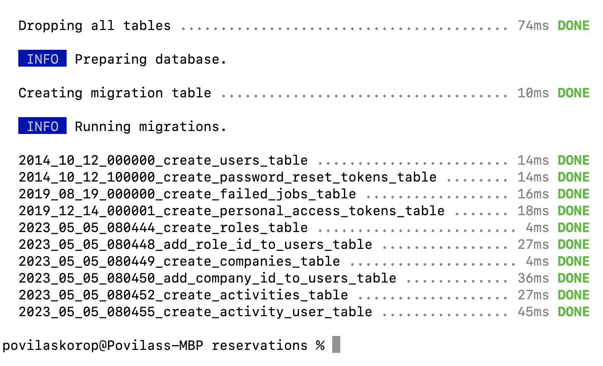

Our first goal, before even starting the coding process, is to transform the initial job description from client into a proper **plan of actions**. There are many ways to do this, and I will explain my own way.

---

## Initial Description from Client

Let's take a look at the initial description of the project, based on a [real job from Upwork](https://www.upwork.com/jobs/~013ff67ca387ff9ae2):


This is how typically clients describe the projects, right? In their own words, briefly, without digging into details. And that's fine, they are not specialists.

So the job of a developer, especially freelancer, is this:

- Transform it into real plan of actions
- While preparing that plan, gather and ask many questions
- Review/edit that plan after getting the answers

Generally, I see my goal as transforming the description into these three concrete things:

- DB Tables Schema and Models
- List of Features to Build
- Step-by-Step Plan of Actions (*which is another angle of feature list above*)

So, let's try to work on exactly that, one by one.

Of course, a lot of things are totally unclear in this simplified job description, and we don't have the contact with the client to ask, so we will **assume** a lot in the course below.

---

## DB Tables and Fields

After re-reading the brief job description, I noted down the list of *entities* which is just a fancy word meaning the equivalent of Eloquent Models or DB Tables. 

Also, I immediately try to envision the fields of the tables, cause that may lead to follow-up questions to the client

- **Roles**: just one field `name` (I envision roles: "administrator", "company owner", "customer" and "guide")
- **Users**: typical default Laravel DB table, adding `role_id` (*we will manage simple permissions in Gates, no DB table needed*)
- **Companies**: just one field `name` - for activity organizers
- **Activities**: `company_id`, `name`, `description`, `start_time`, `price`, `photo(s)`
- **Participants**: which is actually a pivot table `activity_user` with two foreign keys

And that's it! So it seems that we will have a very small project, but will cover all the Laravel basics to make it very practical and learn a lot.

Remember: at this point, your goal is not to build a perfect DB schema from the beginning, but identify the **unclear parts** which would lead to the list of questions to the client.

---

## Laravel Project, Migrations and DB Schema

What I like to do immediately is to **visualize** the relationships. There are different tools for this, but my personal preference is to spin up a Laravel project, create migrations, run them and prepare the visual schema from real database, instead of drawing and entering DB table/column names in some external tool.

So...

```sh
laravel new reservations
cd reservations
``` 

And we have a new Laravel project!

Then, these Terminal commands to generate models and migrations:

```sh
php artisan make:model Role -m
php artisan make:migration add_role_id_to_users_table
```

**Roles Migrations**:
```php
public function up(): void
{
    Schema::create('roles', function (Blueprint $table) {
        $table->id();
        $table->string('name');
        $table->timestamps();
    });
}
```

**app/Models/Role.php**:
```php
class Role extends Model
{
    use HasFactory;
    
    protected $fillable = ['name'];
}
```

**Adding Role ID Migration**:
```php
Schema::table('users', function (Blueprint $table) {
    $table->foreignId('role_id')->constrained();
});
```

**app/Models/User.php**:
```php
class User extends Authenticatable
{
    protected $fillable = [
        'name',
        'email',
        'password',
        'role_id' // [tl! ++]
    ];

    // ...

    public function role()
    {
        return $this->belongsTo(Role::class);
    }
}
```

Next, creating **companies**.

```sh
php artisan make:model Company -m
php artisan make:migration add_company_id_to_users_table
```

**Companies migration**:
```php
Schema::create('companies', function (Blueprint $table) {
    $table->id();
    $table->string('name');
    $table->timestamps();
});
```

**app/Models/Company.php**:
```php
class Company extends Model
{
    use HasFactory;
    
    protected $fillable = ['name'];
}
```

**Adding Company ID Migration**:
```php
Schema::table('users', function (Blueprint $table) {
    $table->foreignId('company_id')->nullable()->constrained();
});
```

**Notice**: in this case, company may be `nullable`, because only one role will belong to a company.

**app/Models/User.php**:
```php
class User extends Authenticatable
{
    protected $fillable = [
        'name',
        'email',
        'password',
        'role_id' 
        'company_id' // [tl! ++]
    ];

    // ...

    public function company()
    {
        return $this->belongsTo(Company::class);
    }
}
```

Finally, schema for **activities**.

```sh
php artisan make:model Activity -m
php artisan make:migration create_activity_user_table
```

**Activities Migration**:
```php
Schema::create('activities', function (Blueprint $table) {
    $table->id();
    $table->foreignId('company_id')->constrained();
    $table->string('name');
    $table->text('description');
    $table->dateTime('start_time');
    $table->integer('price');
    $table->string('photo')->nullable();
    $table->timestamps();
});
```

**Notice**: For now, I don't overcomplicate the photo(s) field and plan to save just the filename, but this will actually be one of the questions to the client (*we'll get to the questions below*). Eventually we may move to using Spatie Media Library with its own `media` DB table. The technical solution isn't *that* important at this stage.

**app/Models/Activity.php**:
```php
class Activity extends Model
{
    use HasFactory;

    protected $fillable = [
        'company_id',
        'name',
        'description',
        'start_time',
        'price',
        'photo'
    ];

    public function company()
    {
        return $this->belongsTo(Company::class);
    }

    public function participants()
    {
        return $this->belongsToMany(User::class)->withTimestamps();
    }
}
```

**Activity participants migration**:
```php
Schema::create('activity_user', function (Blueprint $table) {
    $table->foreignId('activity_id')->constrained();
    $table->foreignId('user_id')->constrained();
    $table->timestamps();
});
```

**Notice 1**: I've named the relationship `participants()` and not just `users()`, for more clarity.

**Notice 2**: Pretty sure it will be important to know WHEN someone registered for the activity, so I added `withTimestamps()` to this pivot table. 

And now, we run the migrations on the empty DB table...

```sh
php artisan migrate
```



Now, when we have the DB schema, we can use any external tool to export it as a visual, with relationships. I personally use [DBeaver](https://dbeaver.io/) for this, which gives us this result:


Great!

Now, wait, our goal wasn't the DB schema, we planned to create a plan of actions and a list of questions to the client?

---

## List of Questions To Ask Client