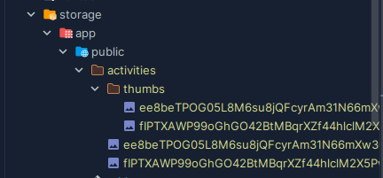
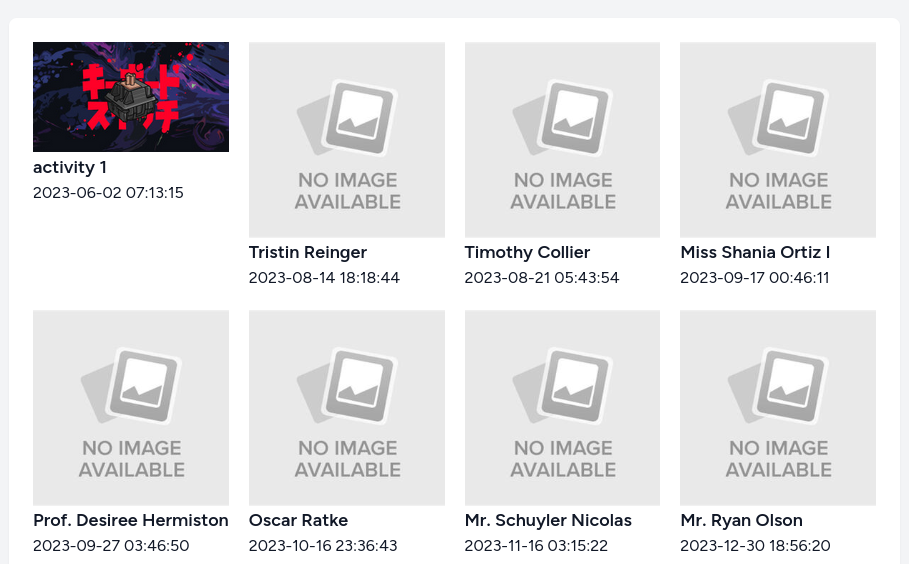
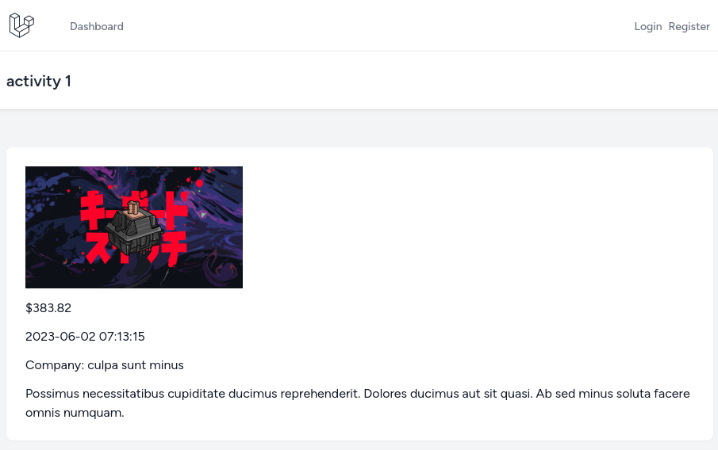

Ok, now our users can manage activities. Time to show them on the public front-facing website, starting with the homepage. 

We need to ask the client how the homepage design would look. But meanwhile, while waiting for the answer, we can still build the functionality prototype using the Laravel Breeze design.

This is what we'll build in this lesson:


Here's the list of topics that we'll cover below:
- Modifying Breeze layout for quickly building frontend features.
- Creating a thumbnail image for the activity.
- Showing activities on the homepage and showing the activity itself.
- Adding dummy data so the client can better see how the homepage will look.
- Writing tests.

---

## Modifying Breeze Layout

Before using Breeze Layout for the homepage, we must make it work for non-authenticated guest users. 

First, create a new [invokable](https://laravel.com/docs/10.x/controllers#single-action-controllers) `HomeController` and rename the `resources/views/dashboard.blade.php` into `resources/views/home.blade.php`.

```sh
php artisan make:controller HomeController --invokable
```

**app/Http/Controllers/HomeController.php**:
```php
class HomeController extends Controller
{
    public function __invoke()
    {
        return view('home');
    }
}
```

Next, we need to change the Routes to use `HomeController`.

**routes/web.php**:
```php
use App\Http\Controllers\HomeController;

Route::get('/', function () { // [tl! remove:start]
    return view('welcome');
});

Route::get('/dashboard', function () {
    return view('dashboard');
})->middleware(['auth', 'verified'])->name('dashboard'); // [tl! remove:end]
Route::get('/', HomeController::class)->name('home'); // [tl! ++]

// ...
```

Because we removed the `dashboard` route, we need to change the global setting of where to redirect after the login.

**app/Providers/RouteServiceProvider.php**:
```php
class RouteServiceProvider extends ServiceProvider
{
    public const HOME = '/dashboard'; // [tl! --]
    public const HOME = '/'; // [tl! ++]

    // ...
}
```

And in the navigation, besides changing the route name, we need to wrap links only for authenticated users with the `@auth` Blade directive.

**resources/views/layouts/navigation.blade.php**:
```blade
<nav x-data="{ open: false }" class="bg-white border-b border-gray-100">
    <!-- Primary Navigation Menu -->
    <div class="max-w-7xl mx-auto px-4 sm:px-6 lg:px-8">
        <div class="flex justify-between h-16">
            <div class="flex">
                <!-- Logo -->
                <div class="shrink-0 flex items-center">
                    <a href="{{ route('dashboard') }}"> {{-- [tl! --] --}}
                    <a href="{{ route('home') }}"> {{-- [tl! ++] --}}
                        <x-application-logo class="block h-9 w-auto fill-current text-gray-800" />
                    </a>
                </div>

                <!-- Navigation Links -->
                <div class="hidden space-x-8 sm:-my-px sm:ml-10 sm:flex">
                    <x-nav-link :href="route('home')" :active="request()->routeIs('home')">
                        {{ __('Dashboard') }}
                    </x-nav-link>
                    @auth {{-- [tl! ++] --}}
                        @if(auth()->user()->role_id === \App\Enums\Role::ADMINISTRATOR->value)
                            <x-nav-link :href="route('companies.index')" :active="request()->routeIs('companies.index')">
                                {{ __('Companies') }}
                            </x-nav-link>
                        @endif
                        @if(auth()->user()->role_id === \App\Enums\Role::COMPANY_OWNER->value)
                            <x-nav-link :href="route('companies.users.index', auth()->user()->company_id)" :active="request()->routeIs('companies.users.*')">
                                {{ __('Administrators') }}
                            </x-nav-link>
                            <x-nav-link :href="route('companies.guides.index', auth()->user()->company_id)" :active="request()->routeIs('companies.guides.*')">
                                {{ __('Guides') }}
                            </x-nav-link>
                            <x-nav-link :href="route('companies.activities.index', auth()->user()->company_id)" :active="request()->routeIs('companies.activities.*')">
                                {{ __('Activities') }}
                            </x-nav-link>
                        @endif
                    @endauth {{-- [tl! ++] --}}
                </div>
            </div>

            <!-- Settings Dropdown -->
            <div class="hidden sm:flex sm:items-center sm:ml-6">
                @auth {{-- [tl! ++] --}}
                    <x-dropdown align="right" width="48">
                        <x-slot name="trigger">
                            <button class="inline-flex items-center px-3 py-2 border border-transparent text-sm leading-4 font-medium rounded-md text-gray-500 bg-white hover:text-gray-700 focus:outline-none transition ease-in-out duration-150">
                                <div>{{ Auth::user()->name }}</div>

                                <div class="ml-1">
                                    <svg class="fill-current h-4 w-4" xmlns="http://www.w3.org/2000/svg" viewBox="0 0 20 20">
                                        <path fill-rule="evenodd" d="M5.293 7.293a1 1 0 011.414 0L10 10.586l3.293-3.293a1 1 0 111.414 1.414l-4 4a1 1 0 01-1.414 0l-4-4a1 1 0 010-1.414z" clip-rule="evenodd" />
                                    </svg>
                                </div>
                            </button>
                        </x-slot>

                        <x-slot name="content">
                            <x-dropdown-link :href="route('profile.edit')">
                                {{ __('Profile') }}
                            </x-dropdown-link>

                            <!-- Authentication -->
                            <form method="POST" action="{{ route('logout') }}">
                                @csrf

                                <x-dropdown-link :href="route('logout')"
                                        onclick="event.preventDefault();
                                                    this.closest('form').submit();">
                                    {{ __('Log Out') }}
                                </x-dropdown-link>
                            </form>
                        </x-slot>
                    </x-dropdown>
                @else {{-- [tl! add:start] --}}
                    <x-nav-link :href="route('login')" :active="request()->routeIs('login')">
                        {{ __('Login') }}
                    </x-nav-link>
                    <x-nav-link :href="route('register')" :active="request()->routeIs('register')">
                        {{ __('Register') }}
                    </x-nav-link>
                @endauth {{-- [tl! add:end] --}}
            </div>

            <!-- Hamburger -->
            <div class="-mr-2 flex items-center sm:hidden">
                <button @click="open = ! open" class="inline-flex items-center justify-center p-2 rounded-md text-gray-400 hover:text-gray-500 hover:bg-gray-100 focus:outline-none focus:bg-gray-100 focus:text-gray-500 transition duration-150 ease-in-out">
                    <svg class="h-6 w-6" stroke="currentColor" fill="none" viewBox="0 0 24 24">
                        <path :class="{'hidden': open, 'inline-flex': ! open }" class="inline-flex" stroke-linecap="round" stroke-linejoin="round" stroke-width="2" d="M4 6h16M4 12h16M4 18h16" />
                        <path :class="{'hidden': ! open, 'inline-flex': open }" class="hidden" stroke-linecap="round" stroke-linejoin="round" stroke-width="2" d="M6 18L18 6M6 6l12 12" />
                    </svg>
                </button>
            </div>
        </div>
    </div>

    <!-- Responsive Navigation Menu -->
    <div :class="{'block': open, 'hidden': ! open}" class="hidden sm:hidden">
        <div class="pt-2 pb-3 space-y-1">
            <x-responsive-nav-link :href="route('dashboard')" :active="request()->routeIs('dashboard')"> {{-- [tl! --] --}}
            <x-responsive-nav-link :href="route('home')" :active="request()->routeIs('home')"> {{-- [tl! ++] --}}
                {{ __('Dashboard') }}
            </x-responsive-nav-link>
        </div>

        <!-- Responsive Settings Options -->
        @auth {{-- [tl! ++] --}}
            <div class="pt-4 pb-1 border-t border-gray-200">
                <div class="px-4">
                    <div class="font-medium text-base text-gray-800">{{ Auth::user()->name }}</div>
                    <div class="font-medium text-sm text-gray-500">{{ Auth::user()->email }}</div>
                </div>

                <div class="mt-3 space-y-1">
                    <x-responsive-nav-link :href="route('profile.edit')">
                        {{ __('Profile') }}
                    </x-responsive-nav-link>

                    <!-- Authentication -->
                    <form method="POST" action="{{ route('logout') }}">
                        @csrf

                        <x-responsive-nav-link :href="route('logout')"
                                onclick="event.preventDefault();
                                            this.closest('form').submit();">
                            {{ __('Log Out') }}
                        </x-responsive-nav-link>
                    </form>
                </div>
            </div>
        @endauth {{-- [tl! --] --}}
    </div>
</nav>
```


---

## Making Thumbnail for Activity

Every activity should have a thumbnail to be shown on the homepage.

We will use the `intervention/image` package to make a thumbnail. Yes, we could use `spatie/laravel-medialibrary,` but I think it would be overkill for only one image per activity for such a small project, at least for now.

```sh
composer require intervention/image
```

Because making thumbnail needs to be done both when creating and editing the activity, we can create a separate private method to avoid repeating the code. 

So the Controller changes would be:

**app/Http/Controllers/CompanyActivityController.php**:
```php
use Intervention\Image\Facades\Image;

class CompanyActivityController extends Controller
{
    // ...

    public function store(StoreActivityRequest $request, Company $company)
    {
        $this->authorize('create', $company);

        if ($request->hasFile('image')) { // [tl! remove:start]
            $path = $request->file('image')->store('activities', 'public');
        } // [tl! remove:end]
        $filename = $this->uploadImage($request); // [tl! ++]

        $activity = Activity::create($request->validated() + [
            'company_id' => $company->id,
            'photo' => $path ?? null, // [tl! --]
            'photo' => $filename, // [tl! ++]
        ]);

        $activity->participants()->sync($request->input('guides'));

        return to_route('companies.activities.index', $company);
    }

    // ...

    public function update(UpdateActivityRequest $request, Company $company, Activity $activity)
    {
        $this->authorize('update', $company);

        if ($request->hasFile('image')) { // [tl! remove:start]
            $path = $request->file('image')->store('activities', 'public');
            if ($activity->photo) {
                Storage::disk('public')->delete($activity->photo);
            }
        } // [tl! remove:end]
        $filename = $this->uploadImage($request); // [tl! ++]

        $activity->update($request->validated() + [
            'photo' => $path ?? $activity->photo, // [tl! --]
            'photo' => $filename ?? $activity->photo, // [tl! ++]
        ]);

        return to_route('companies.activities.index', $company);
    }

    // ...

    private function uploadImage(StoreActivityRequest|UpdateActivityRequest $request): string|null // [tl! add:start]
    {
        if (! $request->hasFile('image')) {
            return null;
        }

        $filename = $request->file('image')->store(options: 'activities');

        $img = Image::make(Storage::disk('activities')->get($filename))
            ->resize(274, 274, function ($constraint) {
                $constraint->aspectRatio();
            });

        Storage::disk('activities')->put('thumbs/' . $request->file('image')->hashName(), $img->stream());

        return $filename;
    } // [tl! add:end]
}
```

As you can see, we are using a disk called `activities` for file upload. We need to add this custom disk to the `config/filesystems.php`.

**config/filesystems.php**:
```php
return [
    // ...
    'disks' => [

        // ...

        'activities' => [
            'driver' => 'local',
            'root' => storage_path('app/public/activities'),
            'url' => env('APP_URL').'/storage',
            'visibility' => 'public',
        ],

        // ...

    ],
    // ...
];
```

Next, we must delete the image when a new one is uploaded to the edit page. I think [Observer](https://laravel.com/docs/eloquent#observers) would be a perfect fit.

```sh
php artisan make:observer ActivityObserver
```

**app/Providers/EventServiceProvider.php**:
```php
use App\Models\Activity;
use App\Observers\ActivityObserver;

class EventServiceProvider extends ServiceProvider
{
    // ...

    public function boot(): void
    {
        Activity::observe(ActivityObserver::class);
    }

    // ...
}
```

After uploading images, we also have thumbnail images in the `activites/thumbs` directory.



---

## Showing Activities on the Homepage

Now we can show activities on the homepage by paginating them and showing `No activities` if there are none. 

On the homepage, we will show upcoming activities and order them by `start_time` in a simple 3x3 grid layout, 9 records per page.

**app/Http/Controllers/HomeController.php**:
```php
use App\Models\Activity;

class HomeController extends Controller
{
    public function __invoke()
    {
        $activities = Activity::where('start_time', '>', now())
            ->orderBy('start_time')
            ->paginate(9);

        return view('home', compact('activities'));
    }
}
```

**resources/views/home.blade.php**:
```blade
<x-app-layout>
    <x-slot name="header">
        <h2 class="text-xl font-semibold leading-tight text-gray-800">
            {{ __('Dashboard') }}
        </h2>
    </x-slot>

    <div class="py-12">
        <div class="mx-auto max-w-7xl sm:px-6 lg:px-8">
            <div class="overflow-hidden bg-white shadow-sm sm:rounded-lg">
                <div class="p-6 text-gray-900">
                    <div class="grid grid-cols-4 gap-x-5 gap-y-8">
                        @forelse($activities as $activity)
                            <div>
                                thumbnail) }}" alt="{{ $activity->name }}">
                                <h2>
                                    <a href="#" class="text-lg font-semibold">{{ $activity->name }}</a>
                                </h2>
                                <time>{{ $activity->start_time }}</time>
                            </div>
                        @empty
                            <p>No activities</p>
                        @endforelse
                    </div>

                    <div class="mt-6">{{ $activities->links() }}</div>
                </div>
            </div>
        </div>
    </div>
</x-app-layout>
```

This is what we will see:


In the Blade file, I used `thumbnail` for showing thumbnails, but we don't have such a field in the DB. To display the thumbnail, we will use [Accessor](https://laravel.com/docs/eloquent-mutators#defining-an-accessor). Also, if there is no image for the activity, we will show a default image I took from the first Google result.

**app/Models/Activity.php**:
```php
use Illuminate\Database\Eloquent\Casts\Attribute;

class Activity extends Model
{
    // ...

    public function thumbnail(): Attribute
    {
        return Attribute::make(
            get: fn() => $this->photo ? '/activities/thumbs/' . $this->photo : '/no_image.jpg',
        );
    }
}
```

Now it is showing a thumbnail image or the default `no_image.jpg`.



---

## Show Activity

Now that we have the list of activities, we can make images and titles clickable to show the detail page for the activity. But first, we need a Controller and Route.

```sh
php artisan make:controller ActivityController
```

**routes/web.php**:
```php
use App\Http\Controllers\ActivityController;

Route::get('/', HomeController::class)->name('home');
Route::get('/activities/{activity}', [ActivityController::class, 'show'])->name('activity.show'); // [tl! ++]

// ...
```

For the Route, I am using [Route Model Binding](https://laravel.com/docs/routing#route-model-binding), meaning we can return a View and pass the activity to it in the Controller.

**app/Http/Controllers/ActivityController.php**:
```php
use App\Models\Activity;

class ActivityController extends Controller
{
    public function show(Activity $activity)
    {
        return view('activities.show', compact('activity'));
    }
}
```

And in the Blade file, we just show all the information for now.

**resources/views/activities/show.blade.php**:
```blade
<x-app-layout>
    <x-slot name="header">
        <h2 class="text-xl font-semibold leading-tight text-gray-800">
            {{ $activity->name }}
        </h2>
    </x-slot>

    <div class="py-12">
        <div class="mx-auto max-w-7xl sm:px-6 lg:px-8">
            <div class="overflow-hidden bg-white shadow-sm sm:rounded-lg">
                <div class="p-6 text-gray-900 space-y-3">
                    thumbnail) }}" alt="{{ $activity->name }}">
                    <div>${{ $activity->price }}</div>
                    <time>{{ $activity->start_time }}</time>
                    <div>Company: {{ $activity->company->name }}</div>
                    <p>{{ $activity->description }}</p>
                </div>
            </div>
        </div>
    </div>
</x-app-layout>
```

All that is left is to add a link to the homepage.

**resources/views/home.blade.php**:
```blade
// ...
<div class="grid grid-cols-4 gap-5">
    @forelse($activities as $activity)
        <div>
            <a href="{{ route('activity.show', $activity) }}"> {{-- [tl! ++] --}}
                thumbnail) }}" alt="{{ $activity->name }}">
            </a> {{-- [tl! ++] --}}
            <h2>
                <a href="#" class="text-lg font-semibold">{{ $activity->name }}</a> {{-- [tl! --] --}}
                <a href="{{ route('activity.show', $activity) }}" class="text-lg font-semibold">{{ $activity->name }}</a> {{-- [tl! ++] --}}
            </h2>
            <time>{{ $activity->start_time }}</time>
        </div>
    @empty
        <p>No activities</p>
    @endforelse
</div>

// ...
```

Now, after visiting an activity, we should see a similar result:



---

## Seeding Dummy Data

We need to add some "fake" data to show this homepage to the client. Of course, it will be a [Seeder](https://laravel.com/docs/seeding#writing-seeders).

```sh
php artisan make:seeder ActivitySeeder
```

**database/seeders/ActivitySeeder.php**:
```php
class ActivitySeeder extends Seeder
{
    public function run(): void
    {
        Activity::factory(20)->create();
    }
}
```

And we need to call it.

**database/seeders/DatabaseSeeder.php**:
```php
class DatabaseSeeder extends Seeder
{
    public function run(): void
    {
        $this->call([
            RoleSeeder::class,
            ActivitySeeder::class, // [tl! ++]
        ]);
    }
}
```

---

## Tests

Before adding tests for the homepage, we need to fix the seeding process. In the `TestCase`, we added a `$seed` variable to run the main Seeder, but we don't need to seed activities every time. However, we can change it to seed only the roles.

**tests/TestCase.php**:
```php
use Database\Seeders\RoleSeeder;

abstract class TestCase extends BaseTestCase
{
    use CreatesApplication;

    protected bool $seed = true; // [tl! --]
    protected string $seeder = RoleSeeder::class; // [tl! ++]
}
```

First, let's add one more assertion for the image upload test. We added a feature to create a thumbnail, so let's check if a thumbnail has been created. Also, let's change the disk from `public` to `activities`.

**tests/Feature/CompanyActivityTest.php**:
```php
use Tests\TestCase;
use App\Models\User;
use App\Models\Company;
use App\Models\Activity;
use Illuminate\Http\UploadedFile;
use Illuminate\Support\Collection;
use Illuminate\Support\Facades\Storage;
use Illuminate\Foundation\Testing\RefreshDatabase;

class CompanyActivityTest extends TestCase
{
    // ...

    public function test_can_upload_image()
    {
        Storage::fake('activities');

        $company = Company::factory()->create();
        $user = User::factory()->companyOwner()->create(['company_id' => $company->id]);
        $guide = User::factory()->guide()->create();

        $file = UploadedFile::fake()->image('avatar.jpg');

        $this->actingAs($user)->post(route('companies.activities.store', $company), [
            'name' => 'activity',
            'description' => 'description',
            'start_time' => '2023-09-01 10:00',
            'price' => 9999,
            'guides' => $guide->id,
            'image' => $file,
        ]);

        Storage::disk('public')->assertExists('activities/' . $file->hashName()); // [tl! --]
        Storage::disk('activities')->assertExists($file->hashName()); // [tl! ++]
        Storage::disk('activities')->assertExists('thumbs/' . $file->hashName()); // [tl! ++]
    }

    public function test_cannon_upload_non_image_file()
    {
        Storage::fake('activities');

        $company = Company::factory()->create();
        $user = User::factory()->companyOwner()->create(['company_id' => $company->id]);
        $guide = User::factory()->guide()->create();

        $file = UploadedFile::fake()->create('document.pdf', 2000, 'application/pdf');

        $response = $this->actingAs($user)->post(route('companies.activities.store', $company), [
            'name' => 'activity',
            'description' => 'description',
            'start_time' => '2023-09-01 10:00',
            'price' => 9999,
            'guides' => $guide->id,
            'image' => $file,
        ]);

        $response->assertSessionHasErrors(['image']);

        Storage::disk('public')->assertMissing('activities/' . $file->hashName()); // [tl! --]
        Storage::disk('activities')->assertMissing($file->hashName()); // [tl! ++]
    }

    // ...
}
```


Now let's test the homepage:
- Page can be accessed for both guests and authenticated users.
- If there are no activities message `No activities` is shown.
- When there aren't enough activities pagination link isn't shown.
- On the second page, the correct activity is shown.
- And activities are shown in the correct order.

```sh
php artisan make:test HomePageTest
```

**tests/Feature/HomePageTest.php**:
```php
use Tests\TestCase;
use App\Models\User;
use App\Models\Activity;
use Illuminate\Foundation\Testing\RefreshDatabase;

class HomePageTest extends TestCase
{
    use RefreshDatabase;

    public function test_unauthenticated_user_can_access_home_page()
    {
        $response = $this->get(route('home'));

        $response->assertOk();
    }

    public function test_authenticated_user_can_access_home_page()
    {
        $user = User::factory()->create();

        $response = $this->actingAs($user)->get(route('home'));

        $response->assertOk();
    }

    public function test_show_no_activities_when_theres_no_upcoming_activities()
    {
        $response = $this->get(route('home'));

        $response->assertSeeText('No activities');
    }

    public function test_pagination_isnt_shown_when_activities_are_9()
    {
        Activity::factory(9)->create();

        $response = $this->get(route('home'));

        $response->assertDontSee('Next');
    }

    public function test_pagination_shows_correct_results()
    {
        Activity::factory(9)->create();
        $activity = Activity::factory()->create(['start_time' => now()->addYear()]);

        $response = $this->get(route('home'));

        $response->assertSee('Next');

        $response = $this->get(route('home') . '/?page=2');
        $response->assertSee($activity->name);
    }

    public function test_order_by_start_time_is_correct()
    {
        $activity = Activity::factory()->create(['start_time' => now()->addWeek()]);
        $activity2 = Activity::factory()->create(['start_time' => now()->addMonth()]);
        $activity3 = Activity::factory()->create(['start_time' => now()->addMonths(2)]);

        $response = $this->get(route('home'));

        $response->assertSeeTextInOrder([
            $activity->name,
            $activity2->name,
            $activity3->name,
        ]);
    }
}
```


And another test for the activity show. For now, we will just test that page return status `200` if activity exists and  `404` if it doesn't exist.

```sh
php artisan make:test ActivityShowTest
```

**tests/Feature/ActivityTest.php**:
```php
use Tests\TestCase;
use App\Models\Activity;
use Illuminate\Foundation\Testing\RefreshDatabase;

class ActivityShowTest extends TestCase
{
    use RefreshDatabase;

    public function test_can_view_activity_page()
    {
        $activity = Activity::factory()->create();

        $response = $this->get(route('activity.show', $activity));

        $response->assertOk();
    }

    public function test_gets_404_for_unexisting_activity()
    {
        $response = $this->get(route('activity.show', 69));

        $response->assertNotFound();
    }
}
```


