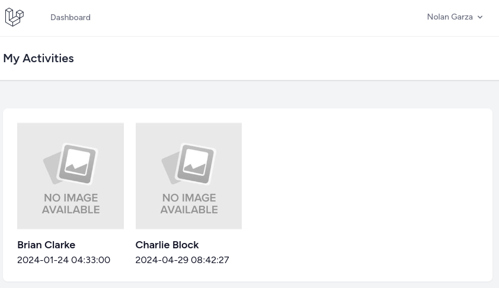

In this lesson, we will add a page where the user with the guide role will be able to see activities assigned to him.

---

## Showing Activities Assigned to Guide

The page `My activities` page for guides will be almost identical. The only difference will be the button instead of `Cancel`, it will be `Export to PDF`. The export functionality will be added in the next lesson. First, let's create a new Route and Controller. The Route endpoint will be different for the guides.

```sh
php artisan make:controller GuideActivityController
```

**routes/web.php**:
```php
use App\Http\Controllers\GuideActivityController;

// ...

Route::middleware('auth')->group(function () {
    Route::get('/activities', [MyActivityController::class, 'show'])->name('my-activity.show');
    Route::get('/guides/activities', [GuideActivityController::class, 'show'])->name('guide-activity.show'); // [tl! ++]
    Route::delete('/activities/{activity}', [MyActivityController::class, 'destroy'])->name('my-activity.destroy');

    // ...
});
```

Now we need to send only the users with the role of guide to this new endpoint. Again, we will make a simple if because this check is not repeating elsewhere.

**resources/views/layouts/navigation.blade.php**:
```blade
// ...
<x-dropdown-link :href="route('profile.edit')">
    {{ __('Profile') }}
</x-dropdown-link>
@if(auth()->user()->role_id === \App\Enums\Role::GUIDE->value) {{-- [tl! add:start] --}}
    <x-dropdown-link :href="route('guide-activity.show')">
        {{ __('My Activities') }}
    </x-dropdown-link>
@else {{-- [tl! add:end] --}}
    <x-dropdown-link :href="route('my-activity.show')">
        {{ __('My Activities') }}
    </x-dropdown-link>
@endif {{-- [tl! ++] --}}
// ...
```

And now, we can get activities assigned to the user and order them by `start_time`. Also, this page must be accessed only by users with the guide role. So, we will abort with the forbidden message if others try to access it.

**app/Http/Controllers/GuideActivityController.php**:
```php
use App\Enums\Role;
use App\Models\Activity;
use Symfony\Component\HttpFoundation\Response;

class GuideActivityController extends Controller
{
    public function show()
    {
        abort_if(auth()->user()->role_id !== Role::GUIDE->value, Response::HTTP_FORBIDDEN);

        $activities = Activity::where('guide_id', auth()->id())->orderBy('start_time')->get();

        return view('activities.guide-activities', compact('activities'));
    }
}
```

And the Blade file to show the activities.

**resources/views/activities/guide-activities.blade.php**:
```blade
<x-app-layout>
    <x-slot name="header">
        <h2 class="text-xl font-semibold leading-tight text-gray-800">
            {{ __('My Activities') }}
        </h2>
    </x-slot>

    <div class="py-12">
        <div class="mx-auto max-w-7xl sm:px-6 lg:px-8">
            <div class="overflow-hidden bg-white shadow-sm sm:rounded-lg">
                <div class="p-6 text-gray-900">
                    <div class="grid grid-cols-4 gap-5">
                        @forelse($activities as $activity)
                            <div class="space-y-3">
                                <a href="{{ route('activity.show', $activity) }}">
                                    thumbnail) }}" alt="{{ $activity->name }}"> </a>
                                <h2>
                                    <a href="{{ route('activity.show', $activity) }}" class="text-lg font-semibold">{{ $activity->name }}</a>
                                </h2>
                                <time>{{ $activity->start_time }}</time>
                            </div>
                        @empty
                            <p>No activities</p>
                        @endforelse
                    </div>
                </div>
            </div>
        </div>
    </div>
</x-app-layout>
```

In the showing of activities, we have the same code in three places. So it would be better to extract it into a component. But because this is just a mock-up to show the client how the functionality works quickly, I think it is not worth it. When the final design is implemented, then I would every repeated part into a Blade component.

Now the `My activities` page should look similar to the image below:



---

## Tests

So, what will we test in this lesson?
- User with the guide role can access the page; other users cannot.
- Guide sees activities only assigned to him.
- Guide sees activities in the correct order.

```sh
php aritsan make:test GuideActivityTest
```

**tests/Feature/GuideActivityTest.php**:
```php
use Tests\TestCase;
use App\Models\User;
use App\Models\Activity;
use Illuminate\Foundation\Testing\RefreshDatabase;

class GuideActivityTest extends TestCase
{
    use RefreshDatabase;

    public function test_guide_can_access_my_activities_page()
    {
        $user = User::factory()->guide()->create();

        $response = $this->actingAs($user)->get(route('guide-activity.show'));

        $response->assertOk();
    }

    public function test_other_user_cannot_access_guide_activities_page()
    {
        $user = User::factory()->create();

        $response = $this->actingAs($user)->get(route('guide-activity.show'));

        $response->assertForbidden();
    }

    public function test_guides_sees_activities_only_assigned_to_him()
    {
        $user = User::factory()->guide()->create();
        $activity = Activity::factory()->create(['guide_id' => $user->id]);
        $activity2 = Activity::factory()->create();

        $response = $this->actingAs($user)->get(route('guide-activity.show'));

        $response->assertSeeText($activity->name);
        $response->assertDontSeeText($activity2->name);
    }

    public function test_guide_sees_activities_ordered_by_time_correctly()
    {
        $user = User::factory()->guide()->create();
        $activity = Activity::factory()->create(['guide_id' => $user->id, 'start_time' => now()->addWeek()]);
        $activity2 = Activity::factory()->create(['guide_id' => $user->id, 'start_time' => now()->addMonth()]);
        $activity3 = Activity::factory()->create(['guide_id' => $user->id, 'start_time' => now()->addMonths(2)]);

        $response = $this->actingAs($user)->get(route('guide-activity.show'));

        $response->assertSeeTextInOrder([
            $activity->name,
            $activity2->name,
            $activity3->name,
        ]);
    }
}
```


